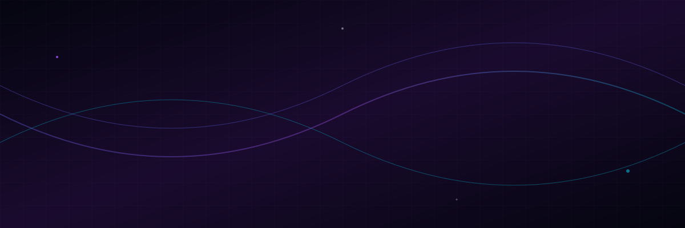
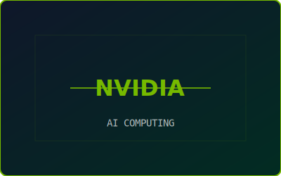
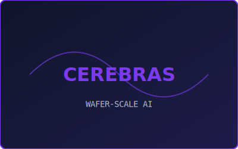
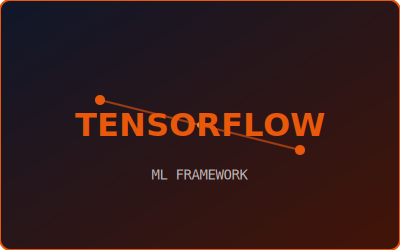
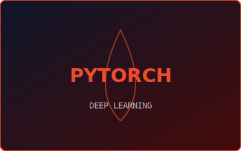
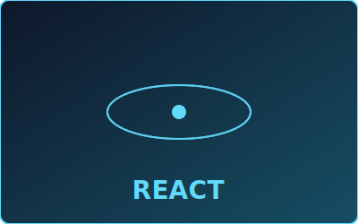
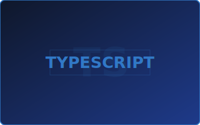
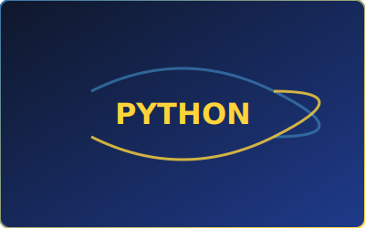
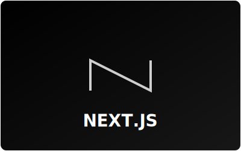

<!-- ═══════════════════════════════════════════════════════════════ -->
<!--              SOUMYA FAYE — GITHUB PROFILE                     -->
<!-- ═══════════════════════════════════════════════════════════════ -->

<div align="center">

<!-- 🎬 HERO BANNER -->


<div align="center">

# Soumya Faye

### `Designer` · `Developer` · `AI & Robotics Engineer`

<a href="https://github.com/soumyafaye-23">
  
</a>

<br/>

[](https://portfolio-website-lg6v.vercel.app)
[](mailto:soumyafaye@gmail.com)
[](https://github.com/soumyafaye-23)


</div>

---

## 🧑‍💻 About Me

```yaml
Name:      Soumya Faye
Pronouns:  he/him
Education: B.Tech CSE — Symbiosis Institute of Technology (SIT), Nagpur
Role:      Autonomous UAV Developer | AI & ML Specialist
Focus:     Building the future of robotics with NVIDIA & Cerebras
Passion:   Bridging design & code to create immersive web experiences
Portfolio: https://portfolio-website-lg6v.vercel.app
```

- 🔭 I'm currently working on **Autonomous UAV Systems & Advanced AI Models**
- 🌱 I'm diving deeper into **NVIDIA Jetson, Cerebras, and Computer Vision**
- 🎨 I bridge the gap between **design** and **code** to create immersive web experiences
- 💬 Ask me about **AI/ML, Robotics, UAV Development, Web Design**
- 📫 Reach me at **soumyafaye@gmail.com**
- ⚡ Fun fact: I'm driven by the challenge of building efficient software and solving complex algorithmic problems

---

<!-- 🌀 PORTAL CTA -->
<div align="center">

### 🌀 Let's Build the Future Together

<a href="https://portfolio-website-lg6v.vercel.app">
  
</a>

<br/>

<a href="https://portfolio-website-lg6v.vercel.app">
  
</a>

</div>

---

<!-- 🛠️ TECH STACK CARDS -->
## 🛠️ Tech Stack

<div align="center">

<table>
<tr>
<td align="center" width="25%">
  
  <br/>
</td>
<td align="center" width="25%">
  
  <br/>
</td>
<td align="center" width="25%">
  
  <br/>
</td>
<td align="center" width="25%">
  
  <br/>
</td>
</tr>
<tr>
<td align="center" width="25%">
  
  <br/>
</td>
<td align="center" width="25%">
  
  <br/>
</td>
<td align="center" width="25%">
  
  <br/>
</td>
<td align="center" width="25%">
  
  <br/>
</td>
</tr>
</table>

#### Also proficient in


</div>

---

## 📊 GitHub Analytics

<div align="center">
  
  
</div>

<div align="center">
  
</div>

---

## 🚀 Featured Projects

<div align="center">

| Project | Description | Tech |
|:-------:|:-----------:|:----:|
| [**🌐 Portfolio Website**](https://github.com/soumyafaye-23/portfolio-website) | Personal portfolio showcasing design & development work |  |
| [**🍽️ Lumanrere**](https://github.com/soumyafaye-23/lumanrere) | Responsive restaurant menu with dishes, prices & categories |    |
| [**📋 NexusTech Event Hub**](https://github.com/soumyafaye-23/form) | Campus-wide event registration web app |  |
| [**✈️ Traveling Blog**](https://github.com/soumyafaye-23/traveling-blog) | "Incredible India" — Shegaon, Manali & Jaipur |  |
| [**💻 DSA Codes**](https://github.com/soumyafaye-23/codetantra-DSA-codes) | DSA practice & algorithmic problem solving |  |
| [**📘 Programming in C**](https://github.com/soumyafaye-23/programing-in-c-) | C programming fundamentals and exercises |  |

</div>

---

## 🎬 NexusTech Event Hub — Demo

> 🎥 **Coming Soon** — A walkthrough demo of the NexusTech Event Hub form flow

---

<div align="center">

### 💜 Thanks for visiting!

*If you like my work, consider giving a ⭐ to my repos!*

</div>
